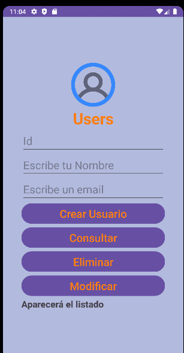
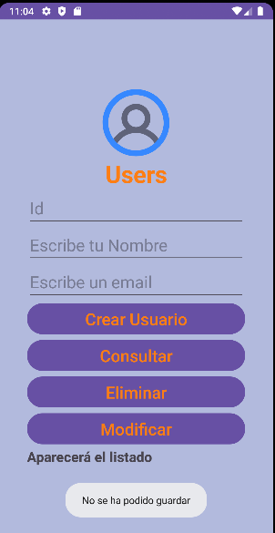
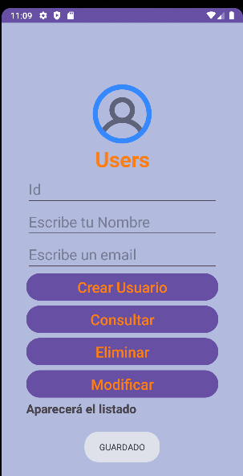
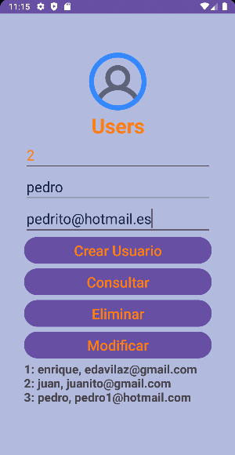
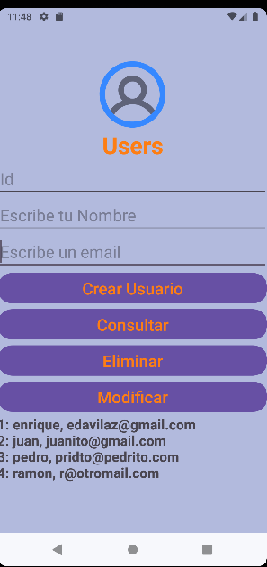
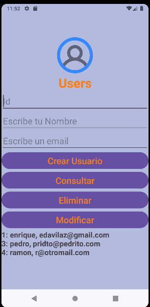
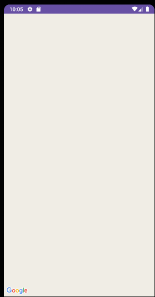
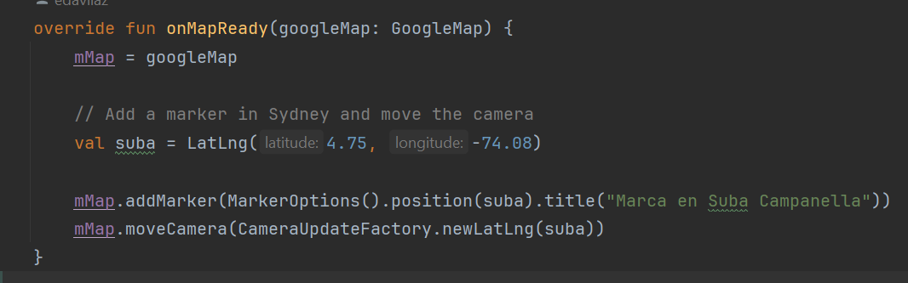
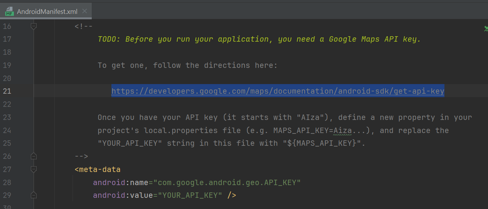

# **Proyecto Desarrollo de Aplicaciones Móviles Nativas**

## Descripción del Proyecto

El presente proyecto es realizado en Android Studio en su versión Iguana (2023).Se realiza la muestra de una aplicación simulando una tienda de artículos.

Al final se logrará, el CRUD de las tablas de Usuario y de productos.

**Se puede ver una descripción inicial de la aplicación en el siguiente link de YouTube:**

## Funcionalidades de la aplicación 

### Pantalla Registro
En esta pantalla ya se puede llegar a crear usuarios, modificarlos, eliminarlos y consultar la lista completa de los que están en la tabla users. Se partió de la siguiente pantalla en un principio.

#### Pantalla Nueva con los cambios
Actualmente se llegó a la siguiente pantalla y se muestran los cambios realizados a la misma.

### CRUD

#### Mensaje de No guardado

En la misma ya se colocan más botones, los cuales logran funcionar correctamente para evidenciar un CRUD. En la siguiente pantalla se muestra una validación que se realiza al intentar crear un usuario sin colocar datos, entonces mediante un mensaje  Toast se muestra un mensaje indicando que no se ha podido guardar el usuario.

#### Mensaje de Guardado

Posteriormente se crea un nuevo usuario y se muestra el mensaje de que fue Guardado.

#### Verificación de Datos Botón Consultar

Al hacer click en el botón consultar, se muestra un listado que por el momento está realizado en un TextView, mostrando el número de Id, el nombre y el email, de los registros creados en la tabla users.

#### Botón Modificar

Posteriormente se muestra la modificación que se hace del usuario número 3, debemos colocar los datos en la parte superior, es decir 3, pedro, pridto@pedrito.com. Luego se pulsa el botón modificar y finalmente el botón consultar, para ver los cambios.

#### Botón Eliminar
Finalmente, para eliminar colocaremos el id 2 y pulsaremos el botón eliminar y finalmente consultar, para tener el siguiente resultado.

## Maps

Se realiza además un botón en el activity principal, el cual nos dirige al activity de geolocalización. (En este momento no se tiene habilitada la api, porque no se generó el KEY API).

La ventana principal, quedó de la siguiente manera:

Y la ventana de Maps sería la siguiente, que como no se habilitó la key sólo muestra el logo de Google.

Se muestra la parte del código donde debe ir ubicación de la latitud y longitud.

En el archivo AndroidManifest.xml es donde debemos colocar el APIKEY, pero no se pudo generar, porque sólo tenía una tarjeta de débito y solicita una de crédito.

## Autor del proyecto

Jaime Enrique Dávila Zuazo

