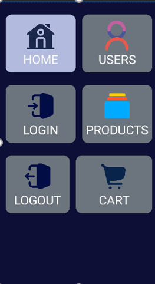
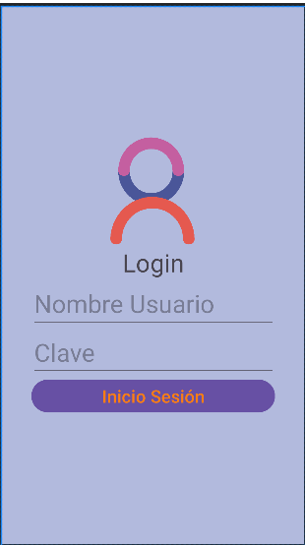
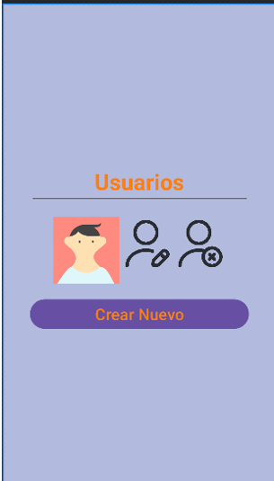
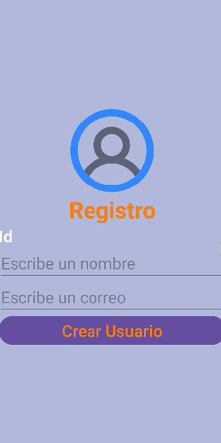
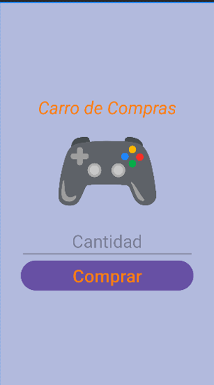

# **Proyecto Desarrollo de Aplicaciones Móviles Nativas**

## Descripción del Proyecto

El presente proyecto es realizado en Android Studio en su versión Iguana (2023).

En el presente proyecto, se realiza la muestra de una aplicación simulando una tienda de artículos.

Al final se logrará el CRUD de las tablas de Usuario y de productos.

**Se puede ver una descripción inicial de la aplicación en el siguiente link de YouTube:**

[Programación de Móviles Nativa (Etapa Contextualización) https://youtu.be/nRB9Zr_zuUc](https://youtu.be/nRB9Zr_zuUc)

## Funcionalidades de la aplicación 

### Pantalla de Inicio
En ella se ingresa a la aplicación móvil y se evidencian seis cardview:
Home, Users, Login, Products, Logout y Cart.

### Pantalla Login
En ella se podrá ingresar con un usuario y correo, además en caso de no estar registrado se podrá realizar la creación de un nuevo usuario.

### Pantalla Users
Se tiene planificado, que la misma sea llenada posteriormente con los datos de una base de datos, que hasta el momento se piensa realizar en sqlite, en la misma se podrá editar, eliminar o crear un nuevo usuario y por supuesto se mostrará el listado de usuarios.

### Pantalla Registro
En esta pantalla el usuario podrá registrarse mediante un nombre de usuario y su correo electrónico.

#### Products
En esta pantalla se tiene la idea de mostrar las acategorias de productos o directamente los productos (aún en análisis), para poder escoger los mismos.

#### Cart
Se tiene planificado lograr insertar el producto en el carro de comprar para determinar que cantidad comprar y finalizar la compra.

#### Variables

Se utilizan las siguientes variables para cambiar colores de la aplicación y para cambiar los textos a mostrar en la misma.

###### colors.xml

`<!--    Colores Por componentes-->
<color name="background_general">#B2BADD </color>
<color name="Background_Component">#6C757D</color>
<color name="Background_Component_Selected">#B2BADD</color>
<color name="Background_App">#0D0F36</color>
<color name="Text">#69D2CD</color>
<color name="Title">#B9F1D6</color>`

###### strings.xml

 `<string name="app_name">Movil</string>
    <string name="home">Home</string>
    <string name="user">Users</string>
    <string name="product">Products</string>
    <string name="cart">Cart</string>
    <string name="login">Login</string>
    <string name="logout">Logout</string>
    <string name="registro">Registro</string>`

## Autor del proyecto

Jaime Enrique Dávila Zuazo

