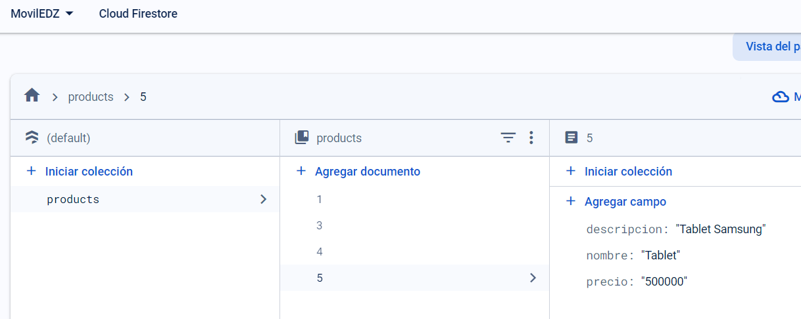

# **Proyecto Desarrollo de Aplicaciones Móviles Nativas**

## Descripción del Proyecto

El presente proyecto es realizado en Android Studio en su versión Iguana (2023).Se realiza la muestra de una aplicación simulando una tienda de artículos.

Al final se logrará, el CRUD de las tablas de Usuario y de productos.

## Descripción Final del Proyecto

Se tiene una ventana principal como se explicó en la anterior entrega ya tiene GoogleMaps. Con la salvedad de la APIKEY, que debe ser habilitada.

## Activity Login

En la activity de usuarios ya no se tiene nada, ya que todas las funcionalidades de usuario quedan en la activity de Login, donde se puede hacer el inicio de sesión, el registro de un nuevo usuario y el CRUD completo que se mostró en la anterior actividad (con SQLite).

## Inicio Sesión

En la presente pantalla, el usuario deberá ingresar mediante su usuario y clave. (La de inicio enrique y edavilaz@gmail.com). Desde esta pantalla nos lleva directamente a la activity de productos. Esto también funcionará con cualquier usuario que esté creado en la tabla usuarios o que se registre.

Al ingresar el inicio de sesión, nos llevará a la vista de productos. En esta tenemos el CRUD completo pero ha mi modo de ver se hace una mejor conexión con FIREBASE. Siguiente el link de la base en firebase.

[https://console.firebase.google.com/u/0/project/moviledz/firestore/databases/-default-/data/~2Fproducts~2F3?hl=es-419](https://console.firebase.google.com/u/0/project/moviledz/firestore/databases/-default-/data/~2Fproducts~2F3?hl=es-419)

## Se muestra el CRUD de productos

### Ingresamos un nuevo producto

### Modificación Registro 5

### Realizo la eliminación del registro 5

## Mayores detalles

La aplicación logra salir de mediante el logout. Una funcionalidad que al realizar el debug no funcionaba correctamente, por lo que se determinó hacer la salida de la aplicación en lugar del cierre de sesión.

## Finalmente se creo la APK

## Desarrollador

Jaime Enrique Dávila Zuazo

